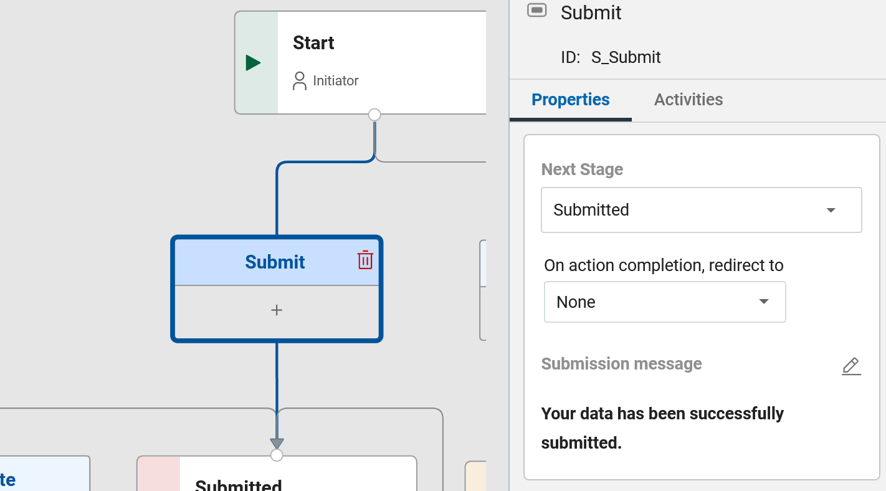

# Redirecting Users After Form Submission

When a user submits a form on a website or application, it's often helpful to guide them to the next logical step. This
could be another form, a confirmation page, or even a different website. In Domino Leap, this process is easily
manageable through the administrator's settings, allowing for a seamless transition between tasks.

Creating a tutorial to explain the concept of "Redirecting users after form submission" in the context of a Domino Leap
application can be an engaging way to introduce beginners to this essential web development functionality. Let's break
down the provided text into a simple, step-by-step tutorial that beginners can easily understand.

#### How to Set Up Redirection 

Let's walk through the steps to set up redirection after a form submission in Domino Leap:

1. **Access the Workflow:**
    - Begin by navigating to the Workflow tab within your Domino Leap application's dashboard. This area allows you to
      manage how your application behaves during different stages of user interaction.

2. **Select the Stage:**
    - Within the Workflow area, you'll see a diagram representing different stages of your application's process. Select
      the Stage button that corresponds to the point at which you want the redirection to occur, typically after a form
      submission.

3. **Configure Redirection:**
    - With the desired stage selected, move over to the Properties tab. Here, look for the section titled "On action
      completion redirect to:". This is where you'll specify what happens after the form submission.
    - You'll be presented with a drop-down menu offering several redirection options:
        - **Another Domino Leap Application:** Choose this to direct users to a different part of your Domino Leap
          suite.
        - **Website URL:** Select this to send users to an entirely different website. This is useful for redirecting to
          external resources or confirmations.
        - **A Form or App Page:** Ideal for guiding users to another form within the same application or to a specific
          app page for further actions or information.

