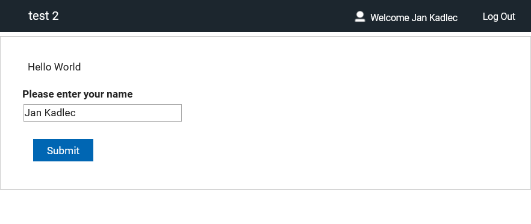
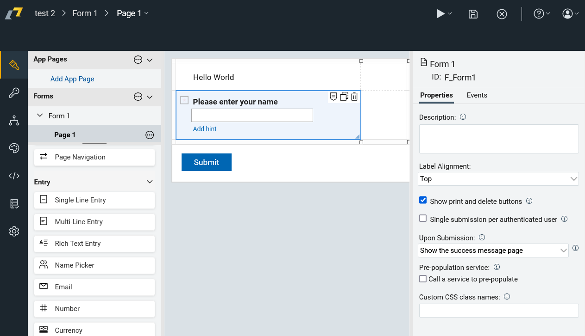
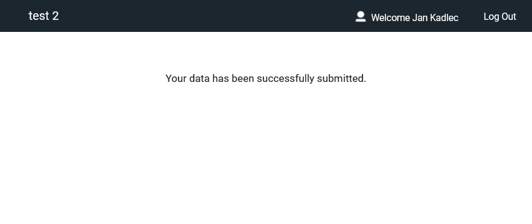
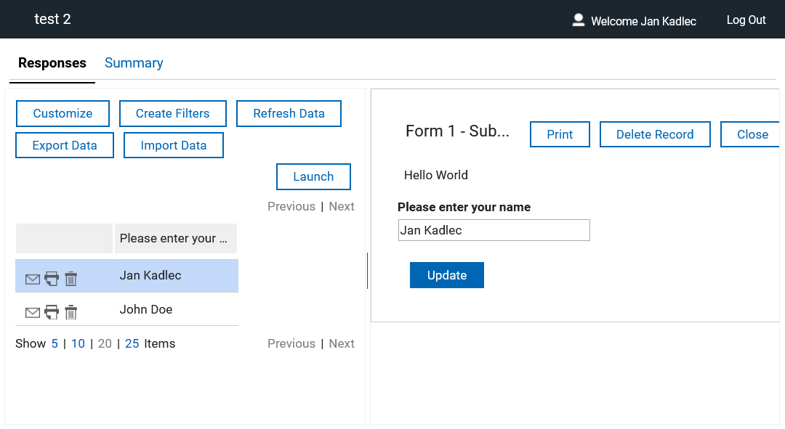

# Create and deploy your first app

Domino Leap can be used to create complex web forms which are called **Applications**. This is the smallest app:

Applications are created using a web **Editor**. Each app must have at least one **Form** and one **Page**. On page there are visual or data elements called **Items**:

Once application development is finished, the apps has to be saved and deployed. After successfull deploy users can launch the app in web browser, enter some data and submit the form. By default, there is a submit notification message:

Domino Leap provides an easy way to explore submited infomration via View Data page. There is one row per each submitted form. Domino Leap uses the same form interface to preview user-submitted data in context. 

Now try it yourself:

::: tip Exercise 1
Create a simple app that displays "Hello world" on the screen. Deploy the app and launch it.
:::

::: details Step-by-Step Solution

1\. Navigate to URL of your HCL Domino Leap

2\. Click "New Application"

3\. Click "Next"

4\. Type name of your app e. g. "My First App"

5\. Click "Create"

6\. Click "Text"

7\. Type "Hello world"

8\. Click here.

9\. Click here.

10\. Click "Deploy"

11\. Click "Start"

12\. Click "Close"

13\. Click "Launch"

