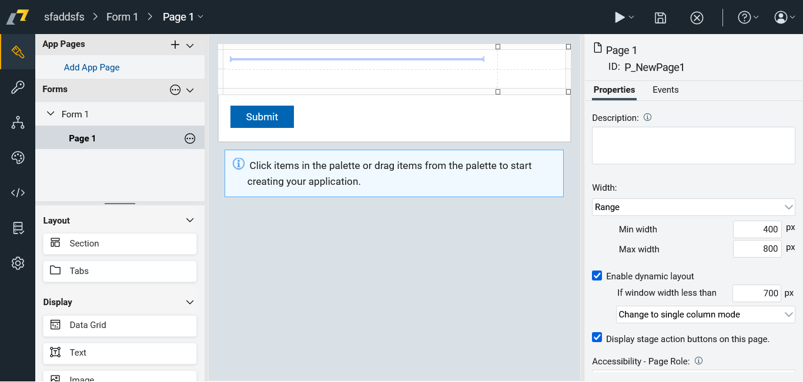
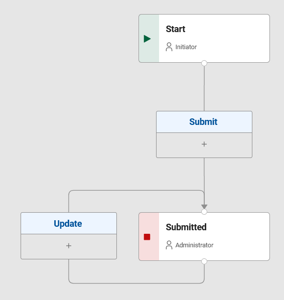
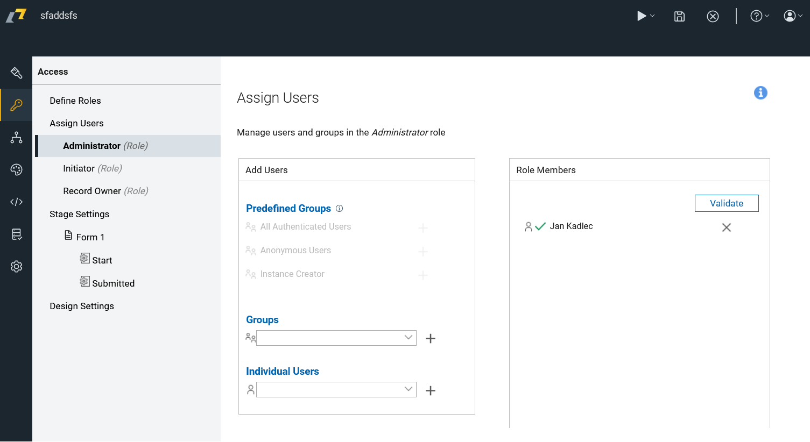
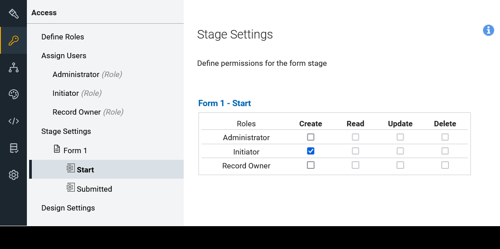
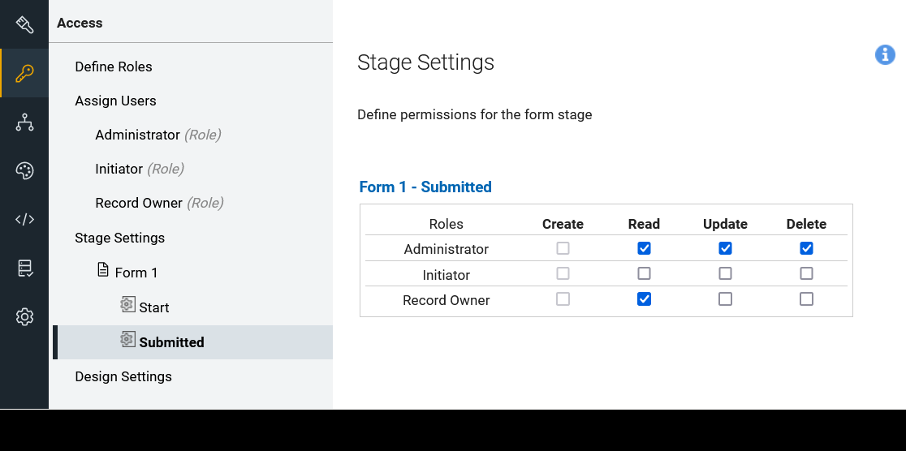

# Introduction to No-code development in Domino Leap

In this chaper, we will cover the basics of no-code development in HCL Domino Leap. To better understand how domino leap
works, we will start by explaining what an MVC model is and how it is used in domino leap. We will also cover the anatomy
of a Domino Leap app and how to create apps in domino leap. Next, we will cover the basics of creating apps in Domino Leap in the following order:
1. Form Page Design
2. Visual Style Configuration
3. Item Rules Creation
4. Stage Addition
5. Stage-Specific Item Locking
6. Role Addition
7. Role Population
8. Permission Setting
9. Additional Page Creation (Optional)
10. Stage-Specific Page Visibility Setting (Optional)
11. App Page Integration (Optional)
12. Service Integration (Optional)
13. Test Data Submission

## App Default Properties
By default th eapp has the following properties:

**One Page**

**Two Stages** — Submitted and start

**Three Roles**
  - **Administrator** - Developer who created the app
  - **Initiator** - User who starts the app - form. By default, initiator can be any authenticated user.
  - **Record Owner** - User who submitted the app - form. By default, a record owner is the initiator.

  

**Permissions**
And following stage permissions:

