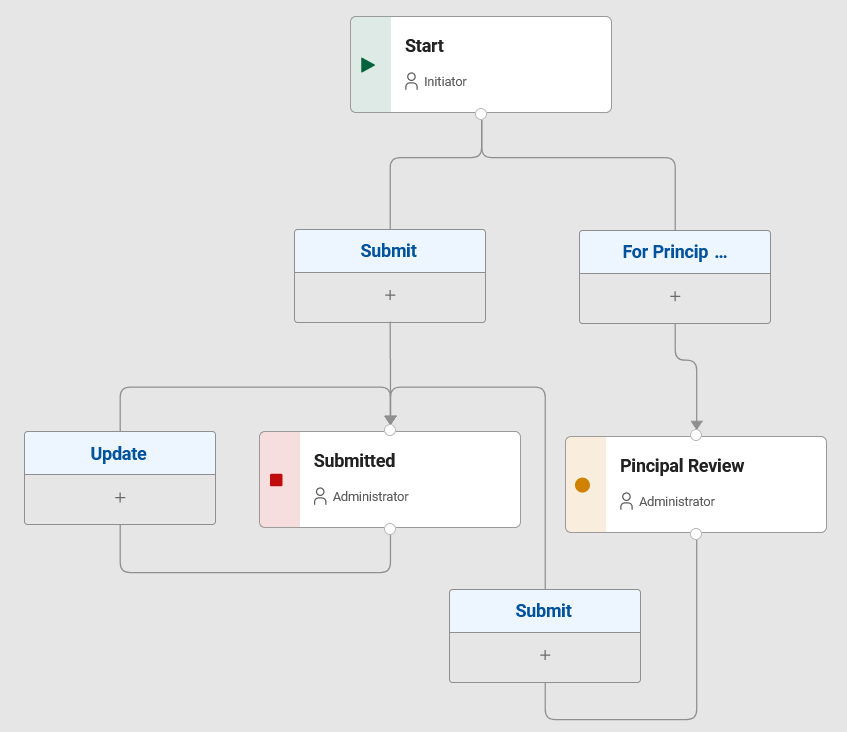

# Workflow - Stages & Actions

The form can be divided into stages, each with its own set of rules and permissions. This allows for a more dynamic and
flexible form that can change based on the stage of the process.

## Stage

### Stage representation

You can find stages in workflow tab. Stage is represented as on image below:

### Using stages

As name suggests, stages are the different steps in a workflow. By default, there are two stages:

- **Start** - the initial stage of the form, which is accessible to users with `Initiator` role.
- **Submitted** - the stage after the form has been submitted, which is accessible to users with `Administator` role.

### Creating new stages

::: tip Task
Create a new stage named "Stage 2".
:::

::: details Step-by-Step Solution

1\. Navigate to workflow

2\. Click here.

3\. New stage created with name "Stage 2"

:::

## Actions

### Action representation

You can find actions in the workflow tab. Action is represented as on image below:

### Action Activities

Each action can have a set of activities that are executed when the action is performed. The activities can be used to:

- Send an email
- Assign users
- Call a service

### Action Button representation in form

We have following example of workflow diagram. Notice that we have two actions in the start stage.

When we look at the form in start stage, we see two action buttons.

## Branching

::: tip Exercise
Add a branch to the workflow with condition "Amount is greater than 10000" on field price.
:::

::: details Step-by-Step Solution

1\. Navigate to workflow tab.

2\. Click here to add another branch.

3\. Click this text field.

4\. Select form field value or user upon witch you want to branch.

5\. Click this dropdown to edit condition.

6\. Click this text field.

7\. Type "10000"

8\. Click "Save"

9\. Here you can see your branches. Click "Activities" to set things such as email reminders.

10\. Click "Properties"

:::

