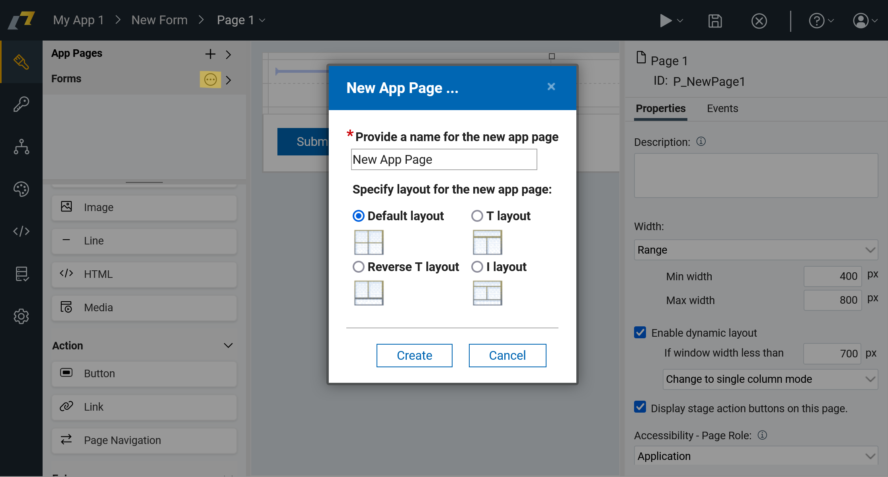

# App Pages

In HCL Domino Leap, app pages are the individual screens or sections of an application where users interact with the
application's content. App pages are used to present information and display data to the user. Each
app page typically represents a specific view within the application or central hub for a particular set of forms and
app pages.

You can place the same items as you are used to do in pages, such
as [input items](./input_items.md), [display items](./display_items.md), etc. The main difference from pages is that
items placed on app pages do not store the data making them read-only.

## Creating App Pages
You can add new app page by clicking on the `...` and `+` icon in the app pages section in the left panel. 

