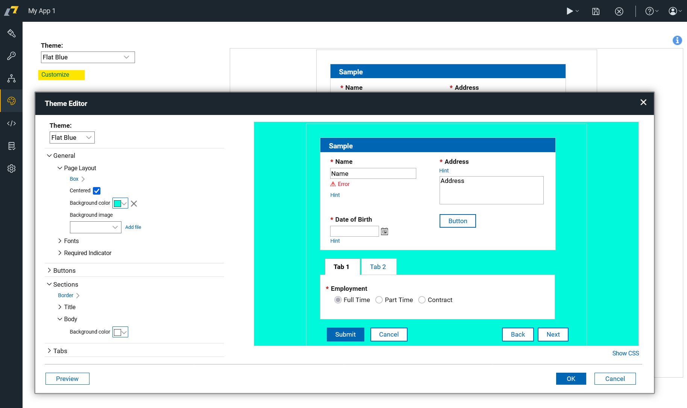
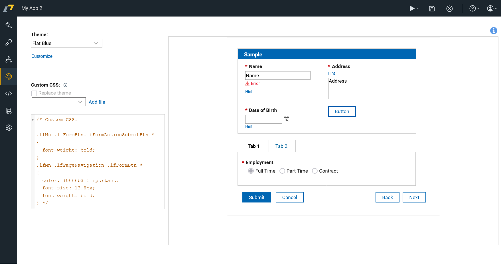
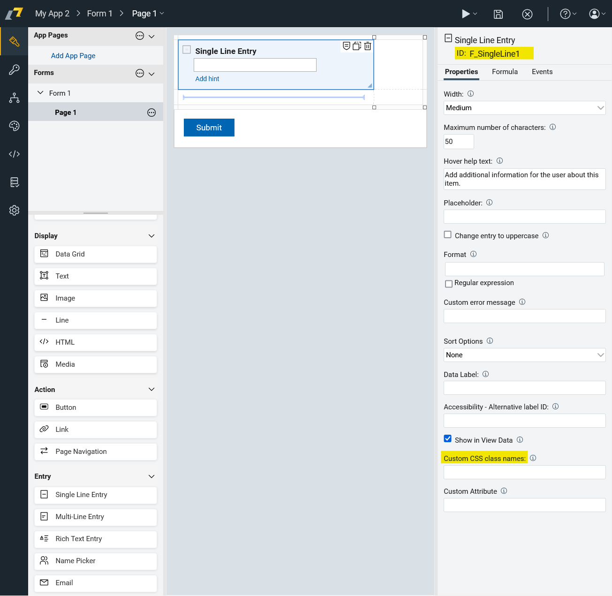
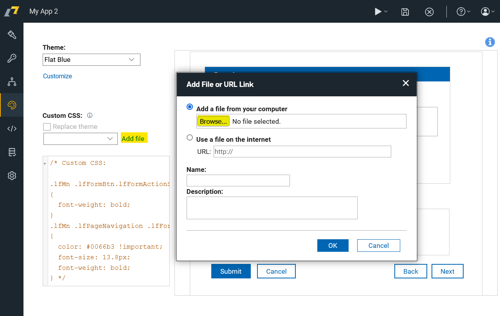

# Vissual Appearence

Domino Leap allows you to easily style your Forms. There are multiple out-of-box visual styles available and you can
style each item using a built-in WYSIWYG editor.



Built-in editor enables you to change colors, fonts, sizes, etc. In addition, you can also use custom CSS to control the look of your application.



## Style Editor


::: tip Exercise
Make button on the website rounded.

:::

::: details Step-by-Step Solution

1\. Navigate to "Style" tab.


2\. Click this dropdown to select one of predefined themes.


3\. Click "Customize" to edit style in detail.


4\. Click here.


5\. Click this image.


6\. Click this text field.


7\. Type "10"

8\. Click this close icon.


9\. Click "OK"


:::

## Working with CSS

You can control the style of your website applications using CSS.
To do that, you need to add a custom CSS declarations to your
project in your style editor or in your custom CSS file.
Then you need to custom classes in your items to correspond to the selectors in the CSS.



**Styling by ID:** Only one element can have a particular ID so styling by ID is used when you want to style only one element.
```css

#myId {
  background-color: lightblue;
  color: white;
  padding: 10px;
  text-align: center;
}
```


**Styling by class:** You can apply the same class to multiple elements. This is useful when you want to style multiple elements in the same way.
```css
.myClass {
  background-color: lightblue;
  color: white;
  padding: 10px;
  text-align: center;
}
```

**Adding Custom CSS file:** You can add custom CSS file to your project. To do that, you need to click on "Add file" button, and then you can add your custom CSS file.



Advanced web developers can explore CSS styles using some web development tools and create their own CSS classes.

Unfortunately, you cannot change the default product icon or change the color of the top bar easily.
