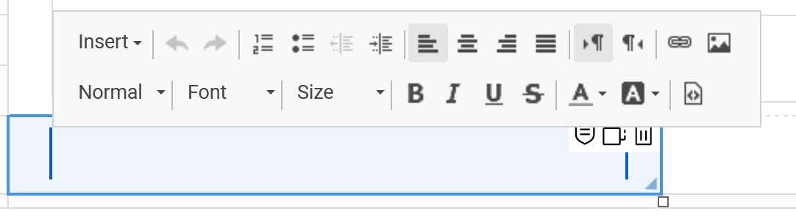
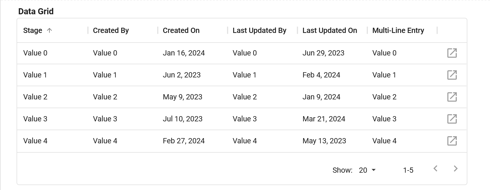

# Display Items

In HCL Domino Leap, display items are used to display the attributes of a business object to the user. Each display item
corresponds to an attribute of the business object and is used to show the value of that attribute. Display items are
read-only and cannot be edited by the user.

## Types of Display Items

There are several types of display items available in HCL Domino Leap, each designed to display different types of data.
The following are some of the most commonly used display items:

- **Text**: A read-only text field for displaying short text values.

- **Data Grid**: A read-only table for displaying tabular data.

- **Image**: A read-only image field for displaying images.

