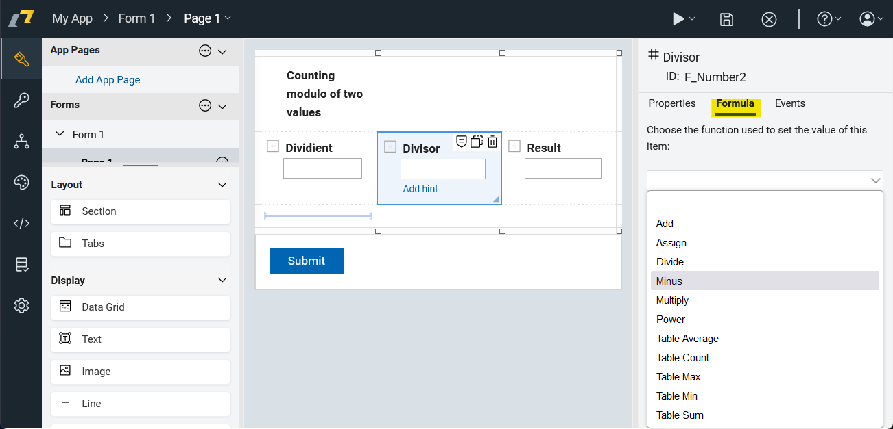

# Formulas

Formulas can be used to calculate the value of a field based on the values of other fields.

::: warning
There is a limitation of 2 operands in formulas. 

This makes it hard to debug formulas with [async calls](/low-code-basics/js_in_dleap/running_js.html#asynchronous-operations). 

Another limitation is that the formulas are not visible in one place.
:::

## Adding formulas

::: tip Exercise
Add a formula to calculate the total price of a product based on the price per piece and the number of pieces.
:::
::: details Step-by-step tutorial

1\. We prepared this form.

2\. Click here.

3\. Click this dropdown.

4\. Click the "Input 1" field.

5\. Click here.

6\. Click the "Input 2" field.

7\. Click "Amount"

8\. Now you can preview the result.

9\. Click "Order"

10\. Click the "Price per piece" field.

11\. Type "39"

12\. Click the "Amount" field and type "2".

13\. Click here.

:::

