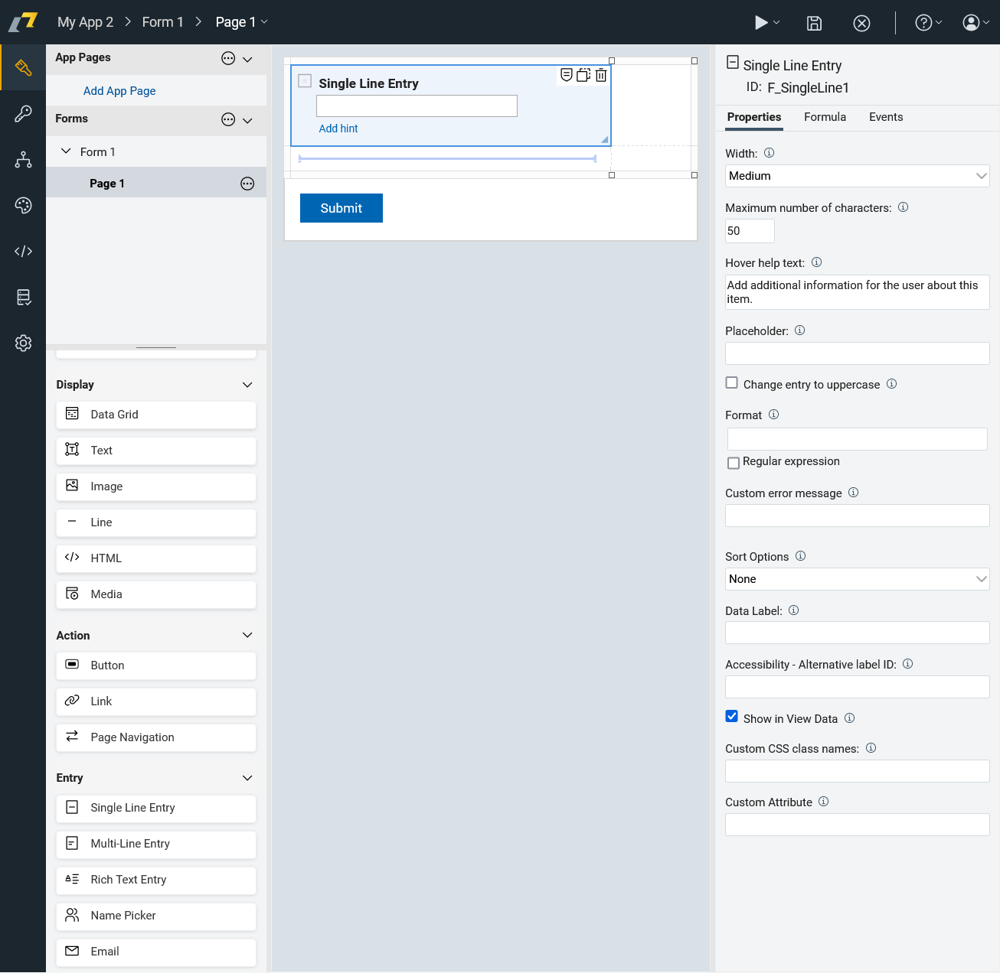
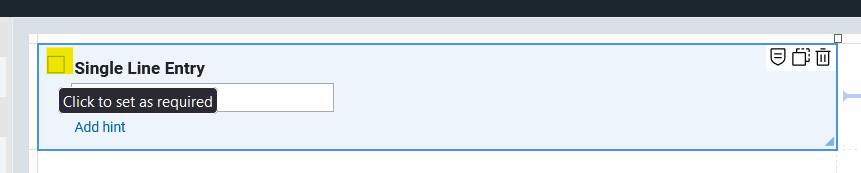
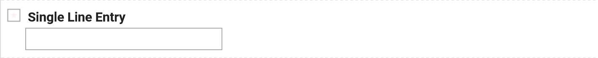
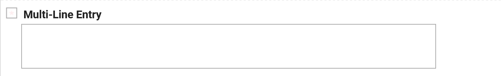
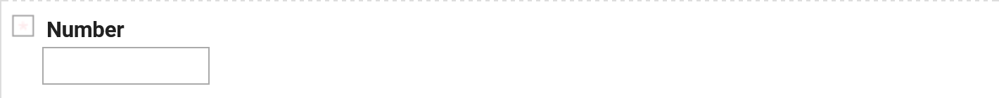
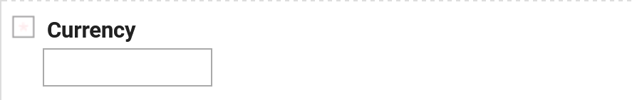
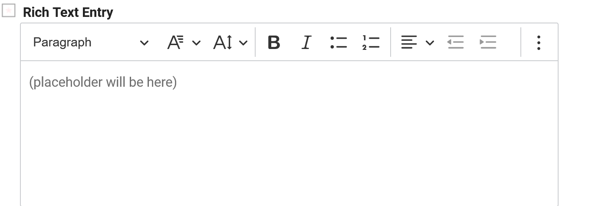

# Input Items

In HCL Domino Leap, items both store data entered by users and represent it visually. The input items are the fields on a form that represent the attributes of a business object. Input
items are used to capture data from the user and store it in the business object. Each input item corresponds to an
attribute of the business object and is used to display and edit the value of that attribute.
## Properties

Each input item has a set of properties that define its behavior and appearance. The following are some of the most commonly used properties of input items:
**width** - The width of the input bar. 
**placeholder** - The text that appears in the input bar when it is empty.
**format** - You can set the format using regular expressions.
**custom css classes names** - You can add custom css classes to the input item. Usually you use your classes from your css file.

## Setting as Required

You can also set items as required. To do that, you need to check "square symbol" next to the required field.

## Types of Input Items

There are several types of input items available in HCL Domino Leap, each designed to capture different types of data.
The following are some of the most commonly used input items:

- **Single Line Entry**: A single-line text input field for capturing short text values.
 
- **Multi-Line Entry**: A multi-line text input field for capturing longer text values.

- **Number Entry**: A numeric input field for capturing numerical values.
   
- **Currency Entry**: A currency input field for capturing monetary values.
 
- **Rich Text Entry**: A rich text editor for capturing formatted text.
 
