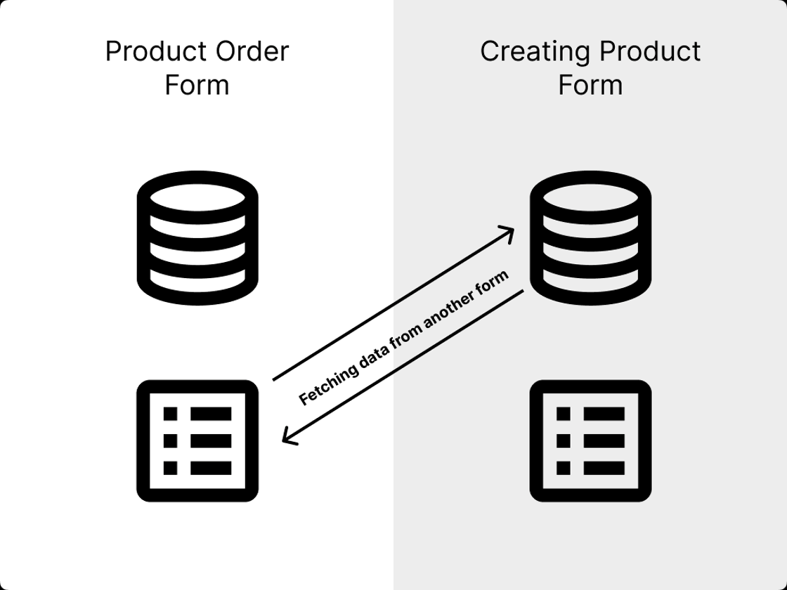

# Multi Form Apps

In this section, we will learn how to create multi-form apps. Multi-form apps are apps that have multiple forms and interact with each other.

As you can see on illustration below, we have two forms. The First form is to create a new product, and the second form is to order selected product.

---

::: tip Exercise
In this task, we will create a service to query data from a Domino database.
We will use this service to fetch data from another form. 
:::

::: details Step-by-step tutorial

1\. In our app we have already created two forms. First creates new product.

2\. Second form is to order selected product.

3\. So now we are now in this state and we want to fetch data from another form.

4\. Navigate to "Settings".

5\. Click "Form 1"  (the form to create an order).

6\. Click "Add Service Configuration"

7\. Click this dropdown and select "Current Application".

8\. Click here to search product added in "Add product" form.

9\. Click "Next"

10\. Click here.

11\. Click "Select product"

12\. Click here.

13\. Click "link symbol"

14\. Click "3. Outputs"

15\. Click here.

16\. Click "Result (F_SingleLine1) "Product Name""

17\. Click "Select product"

18\. Click here.

19\. Click here.

20\. Click here.

21\. Click "Displayed Value"

22\. Click here.

23\. Click "OK"

24\. Navigate to "Design" to add service to select field.

25\. Click here.

26\. Click "Edit"

27\. Click this dropdown  and select Use a Service

28\. Click this dropdown and select service we created.

29\. Click "OK"

:::

