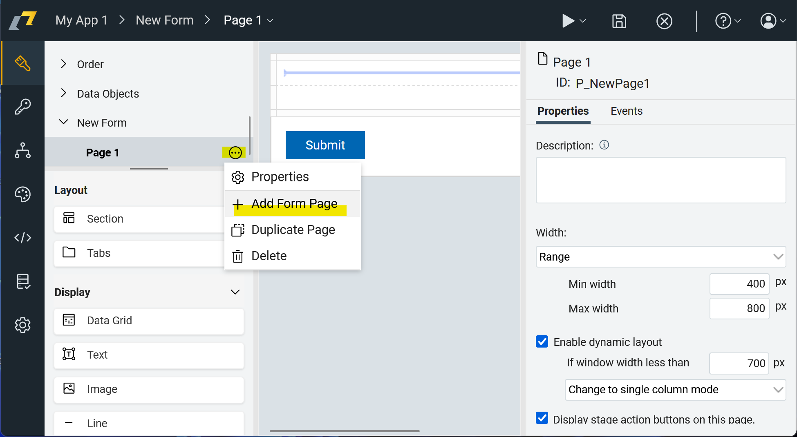

# Multi Page Forms

In HCL Domino Leap, multi-page forms are used to collect and organize data across multiple pages. Multi-page forms are
useful when you have a large amount of data to collect or when you want to group related data together. By breaking the
form into multiple pages, you can make it easier for users to navigate and complete the form. This could be also useful
when you have multiple stages, and you want to show only some pages (described in [Page Visibility](/basics/visibility_page)) to certain users.

## Creating Multi Page Forms
When creating a new form, you can add multiple pages to the form by clicking on the `...` and `+ Add Form Page` icon in the form. You can
then add input items, display items, and other elements to each page to collect and display the data.
