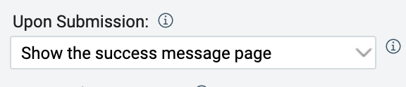
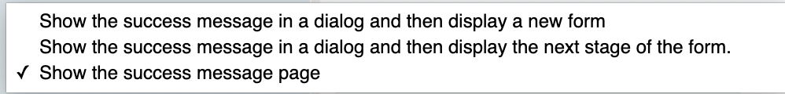
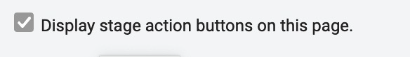
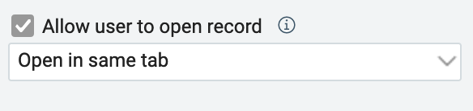
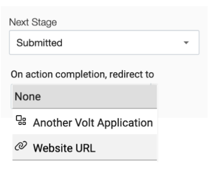
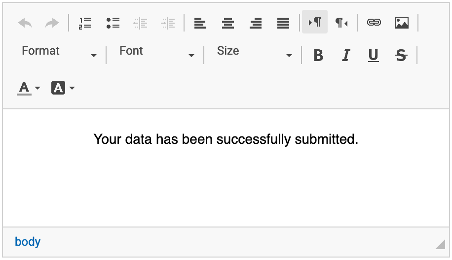
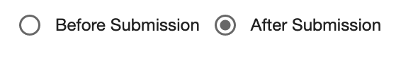

# MVC Model

MVC, which stands for Model, View, Controller, is an architectural design pattern commonly used in programming to
organize applications into distinct layers.

- **Model** - represents the data and logic of the application.

- **View** - handles the user interface and how information is presented.

- **Controller** - acts as the intermediary between the Model and the View, managing user input and business logic.

## HCL Domino Leap MVC

In HCL Domino Leap, the MVC pattern is implemented as follows:

- **Model**

  The Model is represented by the [Business Object](/intermediate/business_object), which encapsulates the data and
behavior of a business entity.

todo ukázka itemů + properties (některé - min max)

- **View**

  The View is represented by the form and app pages, which are used to display the user interface and interact with the
user.

todo Pages, Display item a část properties jako jevilkost zobrazení

-  **Controller**

   The Controller is mostly represented by the [Events](/low-code-basics/js_in_dleap/running_js), which manage user input
and trigger actions based on user interactions, and [Action Buttons](/basics/stages.html#action-activities), which are used to trigger actions in the application
and change form stages.

Here are some examples of controller trough out the application:
 - Form properties
   
     

    
 - Page properties
   
     
 - Data grid properties
   

 - Action buttons properties
   
  

 - Activity properties
   
  
