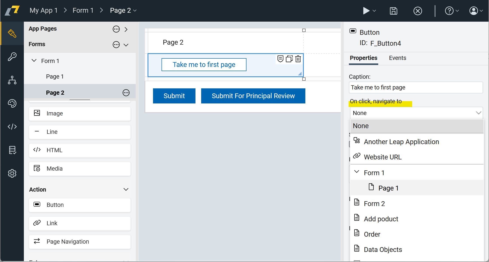

# Navigation

In HCL Domino Leap, the navigation is the process of moving between different pages or sections of an application.
Navigation is an essential part of the user experience and plays a crucial role in guiding users through an application.

## Types of Navigation

In HCL Domino Leap, there are several types of navigation available, each designed to help users move around the
application efficiently. The following are some of the most commonly used navigation types:

### Navigation Item

You can add page navigation item in the app. The navigation will enable the user to navigate between different
neighbouring pages in the app.

### Button

To use the button as a navigation item, you can add a button to the app page and configure it to navigate to a
desired page. Place the button to desired position and then add the action to navigate to the desired page.

