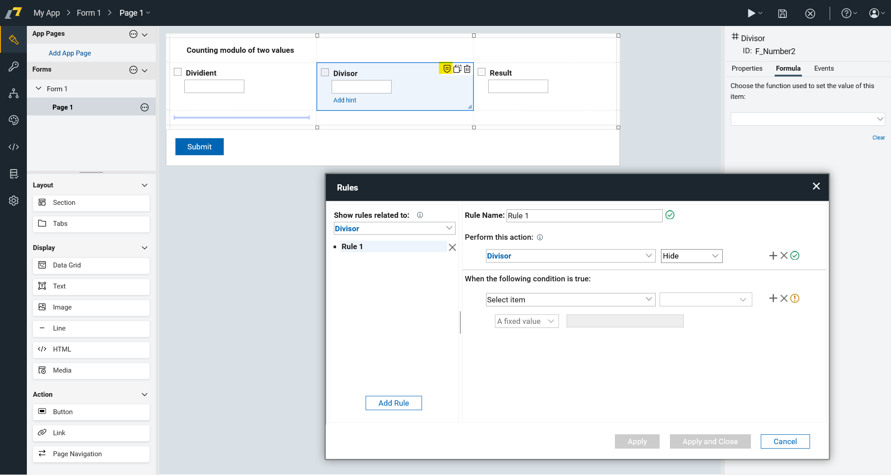
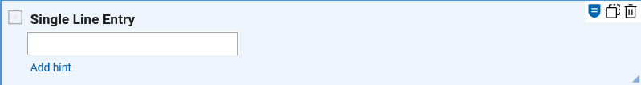
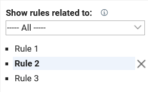
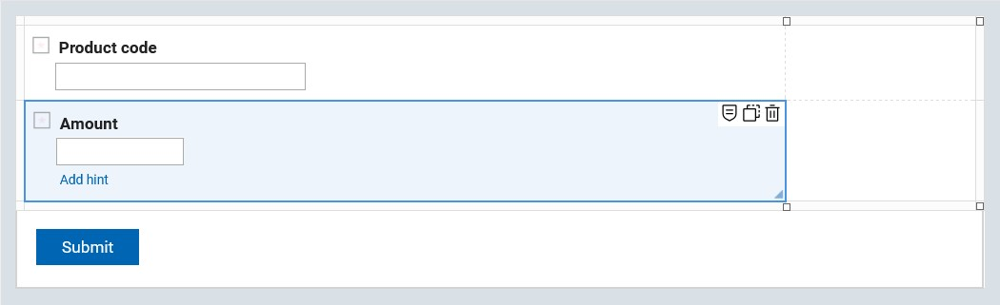

# Rules

Rules allow adding an extra application logic to Forms.
For example, you can hide some items based on the value of some other item.
Rules are a set of IF-THEN conditions connected with Items.

- **Abilities** - 
  Rules allow you to change the visibility or enable/disable Items and Action buttons based on value of another Item, current User
  or window width or height.
  You can also use Rules to disable Action buttons when Item input value is empty.

- **Rule presence** -
  To find out whether rule is present on a specific Item, you can select it and check the "armor shield" icon.
  
  
  If you want to see all present rules, you can click the "armor shield" icon in the top right corner of any Item (even
  one not containing any rule).
  Then select "All" option in a right side panel.
  

## Adding rules

::: details Step-by-step tutorial

1\. We have the following form.

2\. In your form, click the "armor shield" icon to add rule.

3\. We want to make Section object hidden when Price less than 3000$.

4\. Click the "Form Items" field.

5\. Click this text field.

6\. Click "Section"

7\. Click this text field.

8\. Click here.

9\. Click this dropdown and change it to "less than".

10\. Click this text field.

11\. Type "3000"

12\. Click "Apply and Close"

:::

::: tip
It is a good practice to name rules. It can save you a lot of trouble when you have larger amount of rules.
:::

You can connect rules also with AppItems (submit buttons). This is not so straightforward because you have to
display the given button first.

::: info Exercise
Try to hide the action button when the amount is less than 4. You can use the following form.

:::

::: details Step-by-step solution

1\. First, you need to create your form for order. Our has one short text and one number type inputs.

2\. Click "Armor Shield"

3\. Double-click the "Rule Name:" field.

4\. Type "Hide Action Button"

5\. Click the "Form Items" field.

6\. Click this text field.

7\. Click "Start - Submit"

8\. Click here.

9\. Click "Amount (min. 4)"

10\. Click this dropdown and change it to "less than".

11\. Click this text field.

12\. Type "4" (image has a mistake)

13\. Click "+" to add another condition.

14\. Click "At least one is true (OR)"

15\. Click "Apply"

16\. Click this text field.

17\. Click "Amount (min. 4)"

18\. Click this dropdown.

19\. Click "Apply"

20\. Click "Add Rule"

21\. Double-click the "Rule Name:" field.

22\. Type "Show Item"

23\. Click this text field.

24\. Click "Start - Submit"

25\. Click this dropdown.

26\. Click the "Form Items" field.

27\. Click this text field.

28\. Click "Amount (min. 4)"

29\. Click this dropdown.

30\. Click here.

31\. Click this text field.

32\. Type "4"

33\. Click "Apply"

34\. Click "Apply and Close"

35\. Save your app.

36\. We entered proper amount so you se submit button.

37\. In this case you can not see submit button because we have entered wrong amount.

:::

