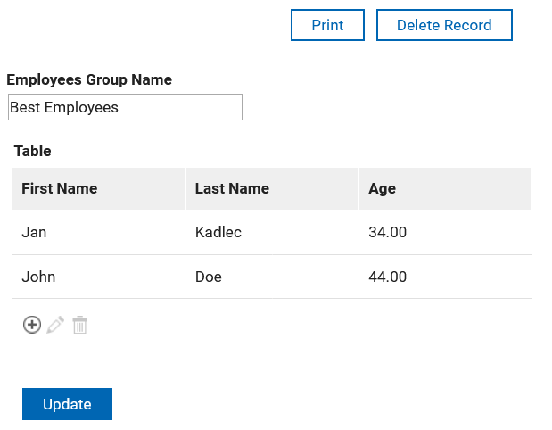

# Tables

Tables are a common way to display data in a structured format. In HCL Domino Leap, tables are a bit special because you need to create a separate form representing table row. The table enables you to create new items.

::: tip Example
Create a table `Customers` with the following columns `First Name`, `Last Name`, and `Age`.
:::
::: details Step-by-Step Solution
# Create employee table and enter data.

1\. Navigate to your app

2\. Click "Single Line Entry"

3\. Click "Table"

4\. Click "here"

5\. Click here.

6\. Click "Single Line Entry"

7\. Click "Single Line Entry"

8\. Click "Number"

9\. Click "Single Line Entry"

10\. Type "First Name"

11\. Double-click "Single Line Entry"

12\. Type "Last Name"

13\. Click "Number"

14\. Type "Age"

15\. Click here.

16\. Double-click "Single Line Entry"

17\. Double-click this text field.

18\. Click this text field.

19\. Double-click this text field.

20\. Type "Employee Group Name"

21\. Click here.

22\. Click here to close.

23\. Click "Deploy"

24\. Click "Start"

25\. Click this image.

26\. Click "Launch"

27\. Type "Best Employees"

28\. Click "+"

29\. Type "Jan [[tab]] Kadlec [[tab]] 33 [[tab]]  [[enter]]"

30\. Click "+"

31\. Type "John [[tab]] Do44"

32\. Click "Add"

33\. Click "Submit"

34\. Click "View Data"

35\. Click "Best Employees"

36\. Now you see the submitted data.

:::