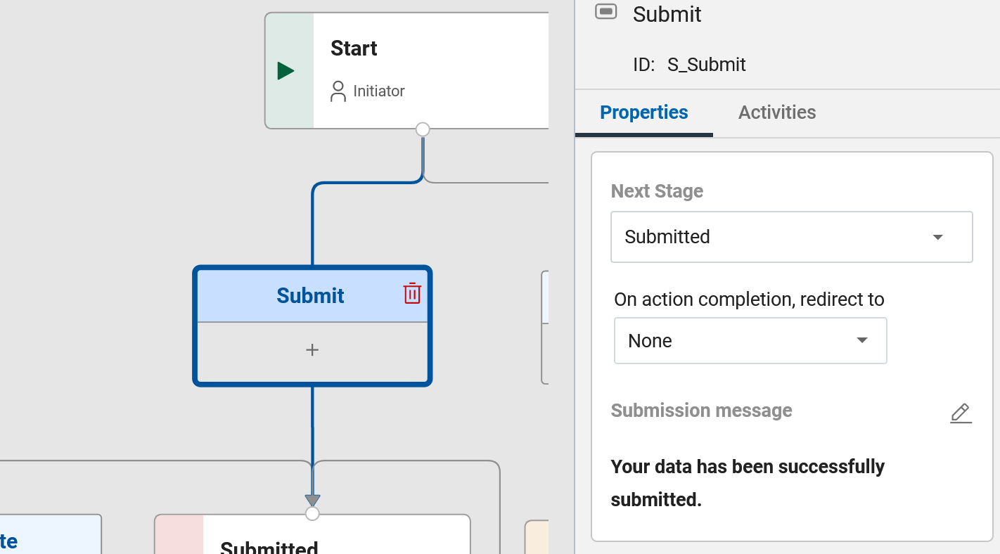

# Redirecting Users After Form Submission

When a user submits a form on a website or application, it's often helpful to guide them to the next logical step. This
could be another form, a confirmation page, or even a different website. In Domino Leap, this process is easily
manageable through the administrator's settings, allowing for a seamless transition between tasks.

Creating a tutorial to explain the concept of "Redirecting users after form submission" in the context of a Domino Leap
application can be an engaging way to introduce beginners to this essential web development functionality. Let's break
down the provided text into a simple, step-by-step tutorial that beginners can easily understand.

#### How to Set Up Redirection 

Let's walk through the steps to set up redirection after a form submission in Domino Leap:

1. **Access the Workflow:**
    - Begin by navigating to the Workflow tab within your Domino Leap application's dashboard. This area allows you to
      manage how your application behaves during different stages of user interaction.

2. **Select the Stage:**
    - Within the Workflow area, you'll see a diagram representing different stages of your application's process. Select
      the Stage button that corresponds to the point at which you want the redirection to occur, typically after a form
      submission.

3. **Configure Redirection:**
    - With the desired stage selected, move over to the Properties tab. Here, look for the section titled "On action
      completion redirect to". This is where you'll specify what happens after the form submission.
    - You'll be presented with a drop-down menu offering several redirection options:
        - **Another Domino Leap Application:** Choose this to direct users to a different part of your Domino Leap
          suite.
        - **Website URL:** Select this to send users to an entirely different website. This is useful for redirecting to
          external resources or confirmations.
        - **A Form or App Page:** Ideal for guiding users to another form within the same application or to a specific
          app page for further actions or information.

