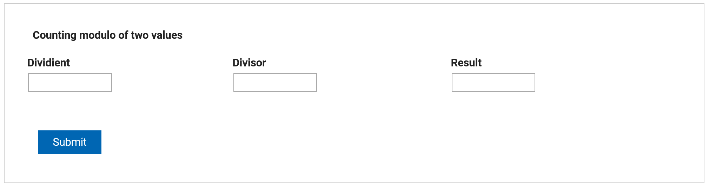

# Working with Items

You should be already familiar with the fact that items in HCL Domino Leap consist of GUI and data part. In this
chapter,
we will discuss how to work with items using JavaScript.

::: tip Example
We want to calculate modulo of tvo values.

Start by creating the following form in the app.


:::

::: details Step-by-Step solution


1\. Click here to show item detail.


2\. Add "onItemChange" event


3\. Click "/\* Add your own JavaScript here. \*/" section to add custom JavaScript.


4\. Add the following code.\

``` javascript
let result = page.F_Number3;\
let divient = page.F_Number1.getValue();\
let divisor = page.F_Number2.getValue();

if( divient && divisor){\
console.log(divient % divisor);\
result.setValue(divient % divisor);\
}
```

5\. Click "OK"


6\. Click "Divisor"


7\. Click "onItemChange"


8\. You need to add the same code for the divisor, because you do not know which element will be edited first.


9\. Click "OK" and you can try it.


:::