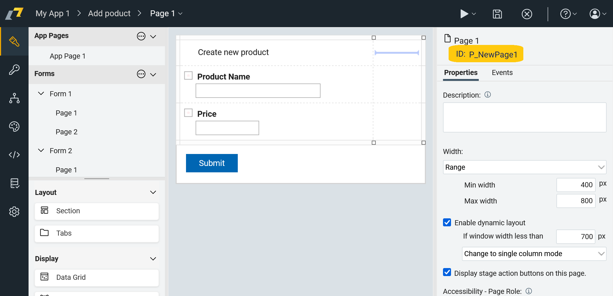

# Objects in HCL Domino Leap

In HCL Domino Leap, objects are used to represent various elements of the application, such as pages, forms, and data.
There are two types of objects - Interface Objects and Data Objects.

- Interface objects exist only at runtime in web browser. They represent GUI elements such as form and pages. These
  objects are not
  persistent and exist only while a form page is shown. Each page keeps reference to data objects which are called
  Items. These are the most used interface objects:
    - `Application` - represents the whole application (Singleton). An application is implemented as an NSF file during
      deployment.
    - `Form` - represents a form within an application. There can be one or more forms. A Form is implemented as a form
      in
      NSF file.
    - `Page` - represents a page within a form. Pages contain visual items (display only) and data items. There can be
      one
      or more pages per form. A Page is a pure UI element. Pages are used to guide users through application workflow.
    - `AppPage` - represents an application page within an application. In contrast to regular pages, app pages cannot
      take part in workflows. Items placed on application pages cannot be saved persistently.
    - `Item` - visually represents an input field on a page. They have both appearance attribute and a value - business
      data entered by users or computed by the
      application.
    - `AppItem` - special type of Item which can be placed on application pages only.

  Interface objects can be accessed by the following variables:
    - `app` - current Application object
    - `appPage` - current Application Page object
    - `page` - current Page object
    - `form` - current Form object
    - `item` - current Item object
    - `apItem` - current Item on an App Page object

- Data objects represent values entered by users in forms. They are used to store persistent data that can be shown or
  modified in subsequent workflow stages. There is one object for each submitted form called BO (Business Object). This
  is an equivalent of a database record or a Notes document in NSF file. Each BO has multiple attributes which
  correspond to each data item. These are the main data objects:
    - `Business Object` - it represents a record in a database (one Notes document).
    - `Business Object Attribute` - it is rarely used to access additional properties of items such as
      currency name for currency items.
    - `Business Object List` -it is used together with table items. Tables produce subforms in NSF files.

  Data objects can be accessed by the following variables:
    - `BO` - current Business Object
    - `BOA` - current Business Object Attribute
    - `BOL` - current Business Object List

      At runtime, it is possible to work both with item values and visual properties. For example, we can hide an item,
      make
      it required or validate user-entered value. Once a form is moved to next stage by pressing an ActionButton the
      data is
      saved persistently. Hence, it may be a bit confusing that data items are referenced both pages and the BO object.

- Other objects represent special entities in applications. They are used for service calls and triggering workflow
  transitions.

[//]: # (todo udělat stejný seznam věcí)

- Components in different contexts
  

## Obtaining Object IDs

You can obtain the ID of an object by clicking on the object in the left panel. The ID is displayed on the right side of
the screen as demonstrated on the following image. 

The ID is used to reference the object in the code. 

