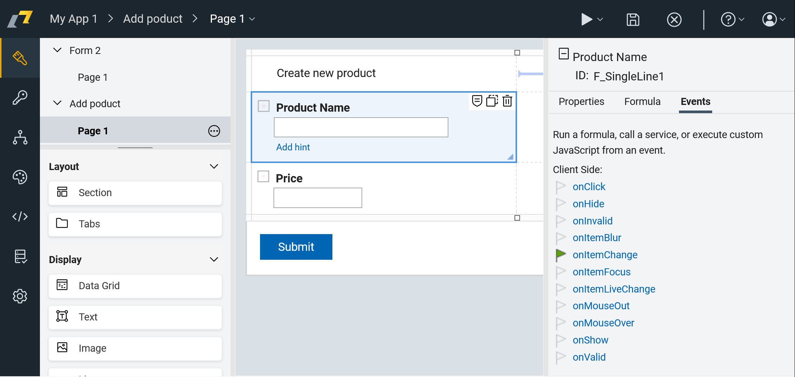
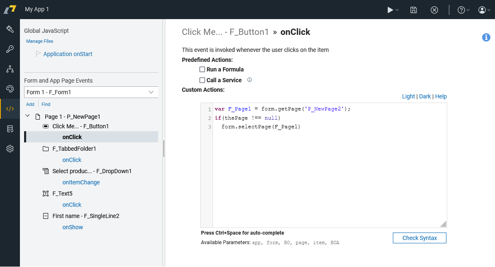
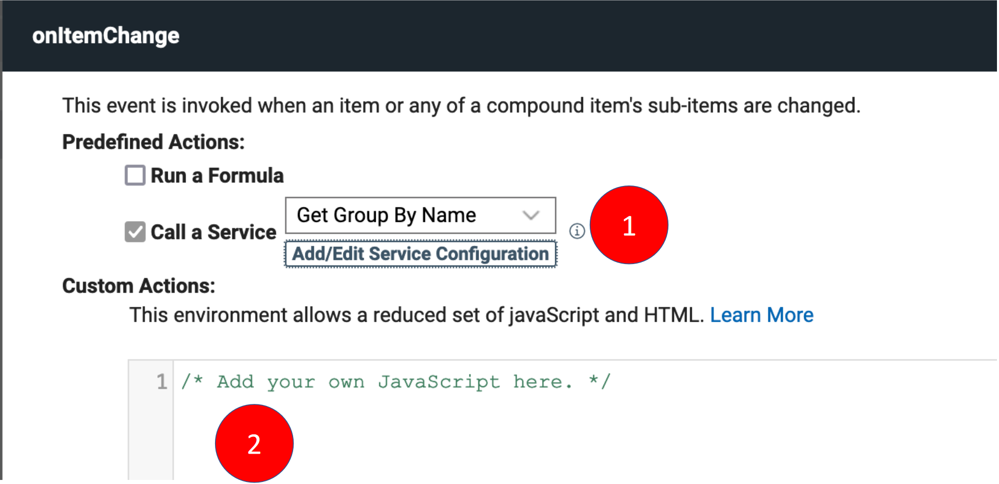
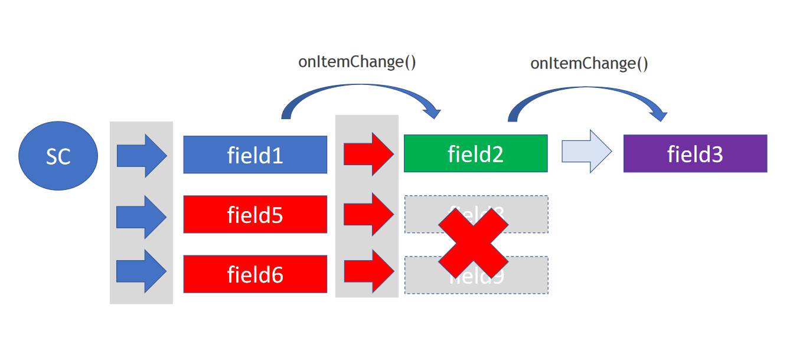

# Running JavaScript in HCL Domino Leap

Every object in Domino Leap has various Events associated with it. Most often Events are used within scope of an Item but there are events also on Pages, Forms and the Application. Item-scoped Events are easily accessible in the Editor.

On the following image you can see that Product name input field has `onItemChange` event associated with it.




## JavaScript Triggered In Events

In HCL Domino Leap, you can create custom code triggered by user interactions or other events in the
application. 


::: details Create an Event - Step-by-Step Guide

1\. Start by navigating to design page.


2\. Click item you want to edit.


3\. In item side panel switch to "Events" tab.


4\. Click the event you want to add or change.


5\. You can write your custom JavaScript into "Custom Actions" section.


6\. To select an item element to add it into your code press `CTRL` + `Space`


7\. If you press `CTRL` + `Space` once more you can add code segments into your code.


8\. As you can see, for each code segment has been added.


:::

### Triggering Event on an item change
You already know how to create an event. Now, let's see how to trigger an event when an item value is modified. To do that, you need to assign the `onItemChange` event. Here is an example of code witch add console log message when item value is changed:


```javascript
// debug value in browser console
console.log("Item value changed " + item.getValue()); 

// copy value into another item
page.F_ProductName.setValue(item.getValue());


```

### Triggering Event in `onShow` page event
Attach an `onShow` event to a page with the following JavaScript to hide an item when the page is shown.
```javascript
// hide item when page is shown
page.F_ProductName.setVisible(false);
```

### Triggering Event in `onLoad` form event
Attach an `onLoad` event to a form with the following JavaScript to hide an item when the form is loaded. We can populate the form with some default data.
```javascript
    BO.F_Date.setValue(new Date());
```
todo - do sth on app start - initialize constanty v globálních datech

### Initializing Constants in Application
You can initialize constants in the application by using the `onStart` event. You can assign `onStart` event in Events page. Here is an example of how to initialize a constant in the application:
```javascript
app.getSharedData().messageBox = function (message) {
    alert("Warning: " + message);
};
```
Calling the function `messageBox` from the `onItemChange` event:
```javascript
app.getSharedData().messageBox("Item value changed");
```


## Asynchronous Operations

Because HCL Domino Leap is built using JavaScript, which is asynchronous by nature, you need to understand how to
synchronize your calls to ensure that your application behaves as expected.

### Service Call + Custom JavaScript

When using service call from UI (1) and custom JavaScript (2), there is no way you can synchronize these two operations.
Here is an example to give you a better picture:



The solution to this problem is to write everything as custom JavaScript and use the service call from there. You can
find more information on synchronization using `onCallFinished` event in
the [Service Calls](/low-code-basics/js_in_dleap/services_js.html#synchronizing-service-calls) page.

## Events Cascading Issue

When you want to update multiple values after change such as service call in sequence, then it is a case of cascading
events illustrated in the following example:

To solve this issue, you can use the `onCallFinished` event described in
the [Service Calls](/low-code-basics/js_in_dleap/services_js.html#synchronizing-service-calls) page. 
